# 💊 Sehat Scan - Medical Convenience

Sehat Scan bridges the gap between patients and doctors by focusing on reports digitization and easier communication between patients and doctors with a **privacy-first approach**. Our platform is built on consent-based medical document sharing, easy data extraction from physical reports, and providing meaningful insights and visualizations from a patient's medical history.

**Our Goal** is to make those doctor visits a little less difficult and painful by establishing a platform that makes patient-doctor communication easier and more informed.

## Documents

- [Project Proposal](https://docs.google.com/document/d/1ubjg1Bi71nlU-PR22TMO6XYPR5IMrLRQcLmqK1MVJXo/edit?usp=sharing)
- [Software Design Specifications (SDS)](https://docs.google.com/document/d/1zvdwuZ1yB1YbO9MyceIKoPD-juDlchHySzHNFyTxjd8/edit?tab=t.0)
- [Software Requirement Specifications (SRS)](https://docs.google.com/document/d/1pswhDW967hvqNKTFjuvj73wh-M2bdwx-eTdV89orlRo/edit?tab=t.0)
- [LucidChart Diagrams](https://lucid.app/lucidchart/e2cdaad6-ec20-403a-a24c-97bcdf5462b5/edit?viewport_loc=-2237%2C1425%2C2418%2C1158%2C0_0&invitationId=inv_82a0da2d-59f8-428b-b267-a15bca78592f)

## Diagrams

### Entity Relationship Diagram

### Operations Flow

```mermaid
flowchart TD
    Start(( ))
    style Start fill:#222,stroke:#222

    A@{ shape: pill, label: "Patient uploads report"}
    B@{ shape: pill, label: "OCR + AI model scans & digitizes report"}
    C@{ shape: pill, label: "Store record in encrypted storage"}
    D@{ shape: pill, label: "Doctor requests access"}
    E@{ shape: pill, label: "Notify patient for approval"}
    F@{ shape: diamond, label: "Patient Approves?"}
    G@{ shape: pill, label: "Generate time-bound access token"}
    H@{ shape: pill, label: "Notify doctor - Request denied"}
    I@{ shape: pill, label: "Doctor views record"}
    J@{ shape: pill, label: "Log access event"}
    K@{ shape: pill, label: "Token expires automatically"}
    Merge@{ shape: diamond, label: " "}
    End((( )))
    style End fill:#222,stroke:#222

    Start --> A
    A --> B
    B --> C
    C --> D
    D --> E
    E --> F
    F -- Yes --> G
    F -- No --> H
    G --> I
    I --> J
    J --> K
    K --> Merge
    H --> Merge
    Merge --> End
```

## Live Links & Resources
- Backend API Base URL: https://sehatscan-abgtfbb6cmgmgugr.uaenorth-01.azurewebsites.net/
- [Backend API Documentation](https://docs.google.com/document/d/1RpLVSMbAwcEmOf2SUU0pHqs8VX4OnvtQZP-_bC84c7A/edit?usp=sharing)

## Tech Stack
- **Frontend:** React Native
- **Backend**: NestJS, Node
- **Cloud:** Microsoft Azure (Deployment), GitHub Actions (CI/CD)
## Contributors
- Muhammad Mohsin  
- Syed Aadil Ahmed  
- Fabiha Ayela  
---
_Project developed at FAST National University, Karachi Campus, Department of CS._
